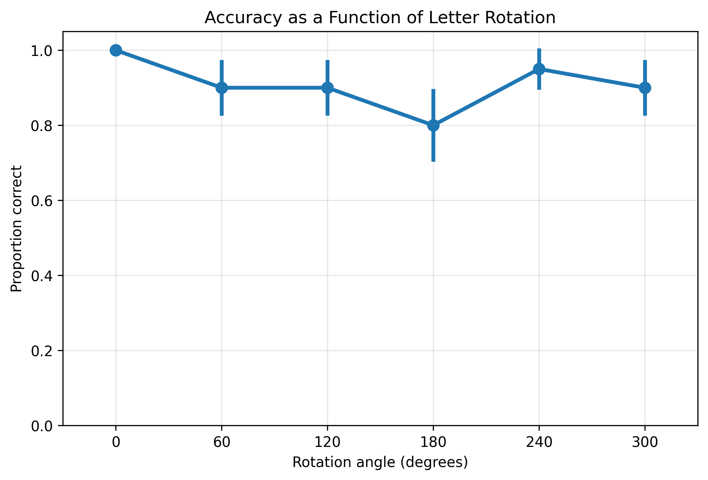
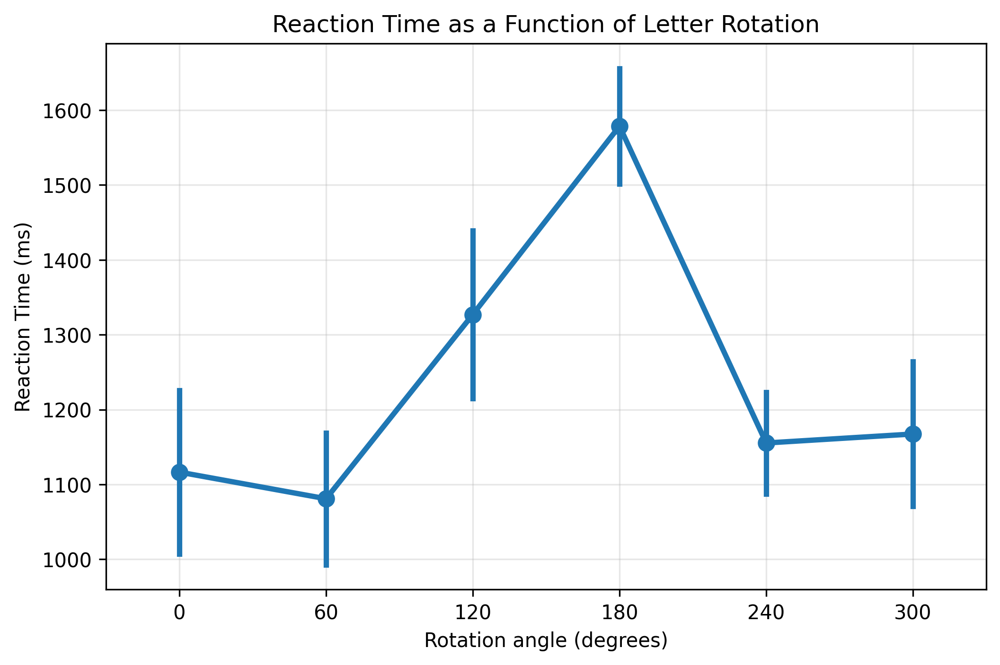
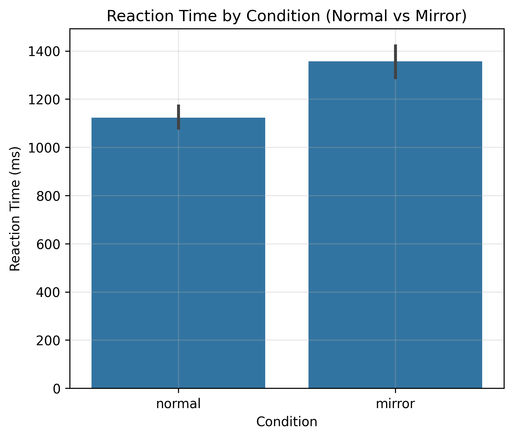

# Mental Rotation of Letters – Replicating Cooper & Shepard (1973)

**Short description.**  
This project implements a modern replication of the classic mental rotation experiment from **Cooper & Shepard (1973), “The time required to prepare for a rotated stimulus”** using the [Expyriment](https://www.expyriment.org) framework in Python. Participants decide whether a rotated letter or digit is normal or mirror-reversed while their reaction times are recorded as a function of rotation angle.

> Goal: reproduce the characteristic increase in reaction time with angular deviation from upright, and explore how closely we can match the original mental rotation patterns with a simple lab-style experiment.


---

## Table of Contents

- [1. Background](#1-background)
- [2. Experimental design](#2-experimental-design)
- [3. Code structure](#3-code-structure)
- [4. Running the experiment](#4-running-the-experiment)
- [5. Data format & analysis](#5-data-format--analysis)
- [6. Example results](#6-example-results)
- [7. Citation](#7-citation)

---

## 1. Background

Cooper & Shepard (1973) showed that the time needed to decide whether a rotated alphanumeric character is normal or mirror-reversed **increases approximately linearly with the angle of rotation** away from the upright orientation. This finding is a cornerstone in the study of **mental imagery and mental rotation**, suggesting that people internally “rotate” a mental image of the stimulus.

This repository provides:

- a minimal, modern implementation of a **letter-rotation task** in Python/Expyriment,  
- tools to **collect data** locally,  
- and a basic **analysis pipeline** to visualize reaction times (RTs) as a function of rotation angle and mirror vs. normal letters.

---

## 2. Experimental design

This implementation generalizes the classic paradigm while keeping its theoretical essence.

- **Stimulus set:** `G`, `J`, `R`, `2`, `5`, `7`
- **Rotations:**  
  `0°, 60°, 120°, 180°, 240°, 300°`
- **Conditions:**  
  - `version = "normal"`  
  - `version = "mirror"` (horizontal flip)
- **Trials:**  
  - 10 repetitions for each (angle × version) combination  
    → 6 angles × 2 versions × 10 reps = **120 trials**  
  - fully randomized order.

### Timing

- Fixation cross: 500 ms  
- Blank inter-trial interval: 500 ms  
- Optional cue: 400 ms  
- Maximum response window: 3000 ms

### Task

Participants press:

- **F** for *normal*  
- **J** for *mirror*

Recorded data:

- trial number  
- rotation angle  
- version  
- key pressed  
- correctness (0/1)  
- reaction time (ms)

---

## 3. Code structure

Main experiment script: [`base.py`](base.py)

Key components:

- **Parameter definitions** (angles, versions, repetitions, timing)
- **Trial generation & randomization**
- **Expyriment setup:**
  - experiment object  
  - fixation cross  
  - blank screen  
  - base character stimuli
- **Instruction screens**
- **Trial loop:**
  - blank screen  
  - fixation  
  - stimulus cloning, rotation, mirroring  
  - optional cue  
  - response collection  
  - correctness computation  
  - logging via `exp.data.add(...)`
- **Experiment conclusion**

Analysis script: [`analyse_xpd.py`](analyse_xpd.py)

Provides:

- `.xpd` file loading  
- descriptive statistics  
- plots for:
  - reaction time by angle  
  - accuracy by angle  
  - reaction time by version  

---

## 4. Running the experiment

1. Install dependencies:
   ```bash
   pip install expyriment pandas matplotlib seaborn
2. Make sure `F` and `J` keys are available
3. Run the experiment
   ```bash
   python base.py
   ```
A `.xpd` file containing all trial data will be created automaticaly 

## 5. Data format & analysis

All data are saved automatically by Expyriment in a `.xpd` file, which contains one row per trial.

Each row includes:

- `trial`: trial index  
- `angle`: rotation angle (0–300°)  
- `version`: `"normal"` or `"mirror"`  
- `respkey`: key pressed (`f`, `j`, or none if timeout)  
- `correct`: 1 or 0  
- `RT`: reaction time in milliseconds (or NaN if no response)

The analysis pipeline in [`analyse_xpd.py`](analyse_xpd.py) provides:

- automatic loading and cleaning of `.xpd` files  
- descriptive statistics (mean RT, RT by angle, error rates)  
- three main plots:
  - **Reaction Time as a function of rotation angle**
  - **Accuracy as a function of rotation angle**
  - **Reaction Time by condition (normal vs mirror)**

To run the analysis:

```bash
python analyse_xpd.py
```
This generates the following output files in the working directory:
- `rt_by_angle.png`  
- `accuracy_by_angle.png`  
- `rt_by_version.png`

---

## 6. Example results

### Accuracy as a function of rotation angle


### Reaction time as a function of rotation angle


### Reaction time by condition (normal vs mirror)


These results typically reproduce the classic mental rotation signatures:
- reaction times peak near 180°,
- mirror-reversed stimuli yield slower responses,
- accuracy decreases as rotation increases.

---


## 7. Citation

If you use this repository for teaching, coursework, or research, please cite:

Cooper, L. A., & Shepard, R. N. (1973).  
**The time required to prepare for a rotated stimulus.**  
*Memory & Cognition, 1*(3), 246–250.
